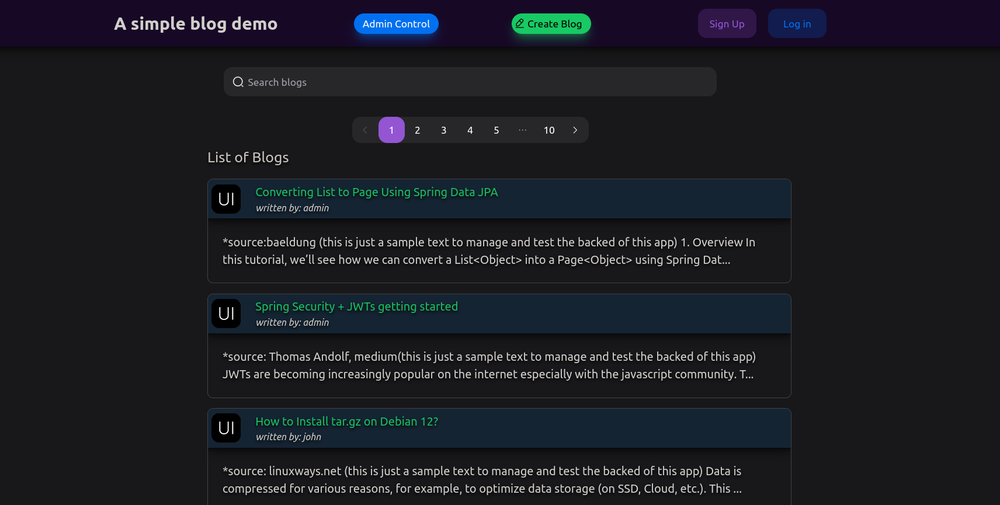
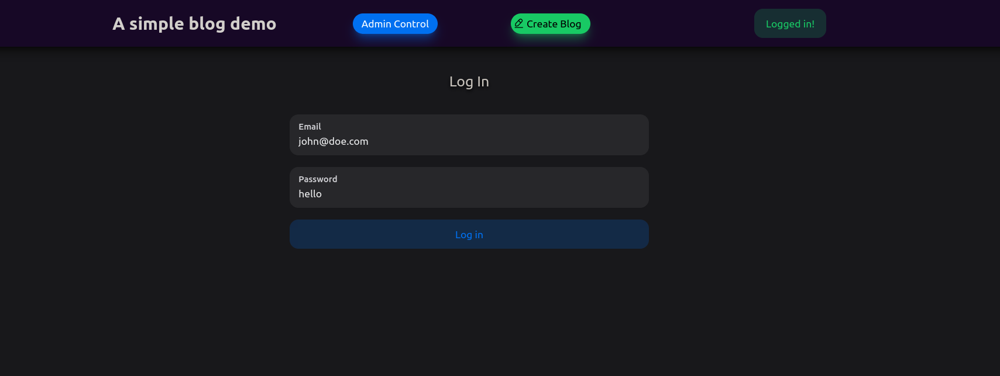
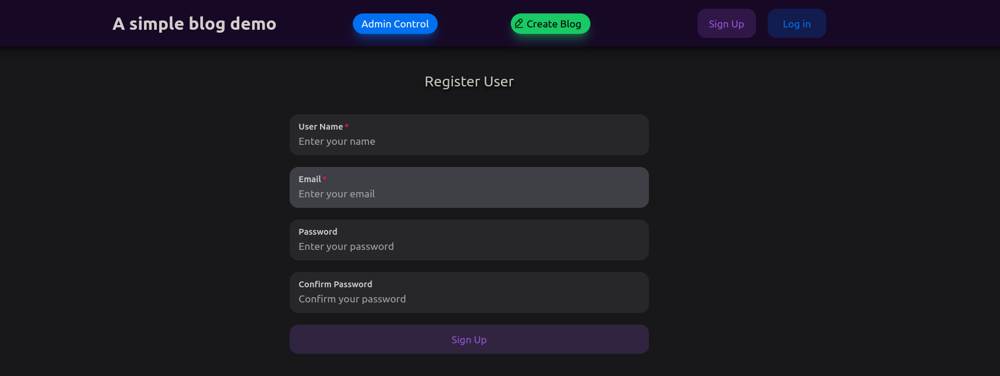
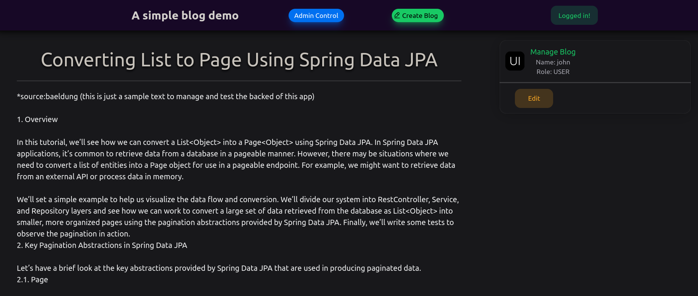
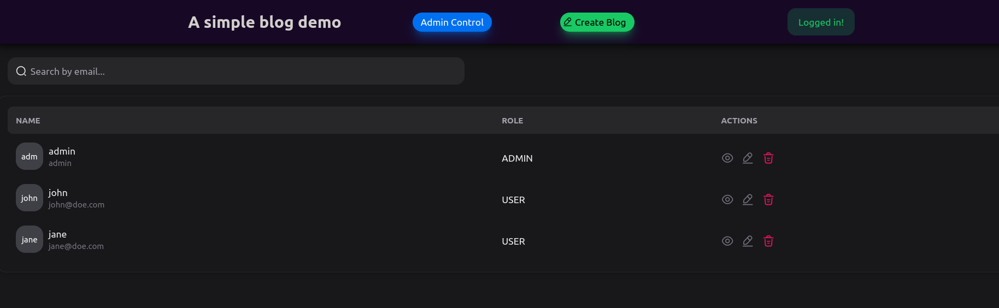
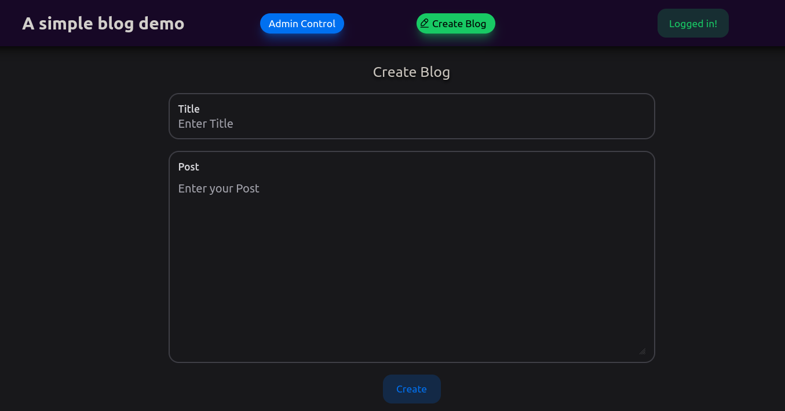

# blog-react-springboot
> Project to authenticate users and manage data with Oauth2/JWT-refresh tokens to perform CRUD operations according to roles and permissions

---

This project is developed with the purpose of understand how to register, authenticate users, validate JWT tokens and generating refresh tokens to perform **CRUD** operations with the validated user using the following libraries and frameworks:

 **Spring-Boot**:
 - Spring Data JPA
 - mariadb
 - Spring Web
 - Spring Security
     - protected endpoints according to roles and privileges
     - authentication with JWT and refresh-tokens

 **React**
 - NextUI library for components
 - rendering components according to roles and authorities
 - protected routes

---

